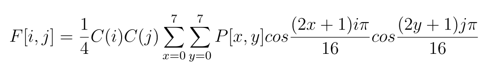

## JPEG Compressor in C (from scratch)

**Author**: Lucas Sales Duarte  
**Institution**: University of São Paulo (USP) — ICMC, São Carlos  
**Subject**: SCC0661 — Multimedia and Hypermedia — USP — São Carlos  
[SCC0661 — Multimídia e Hipermídia — USP](https://uspdigital.usp.br/jupiterweb/obterDisciplina?nomdis=&sgldis=SCC0661)

This project implements a baseline JPEG compressor and decompressor in C without using external image libraries. It applies the standard JPEG theory end‑to‑end, including color conversion, blockwise 2D DCT, quantization, zig‑zag scan, run‑length and Huffman entropy coding. All required tables (DCT transform matrix; luminance and chrominance quantization matrices for 25%, 50%, and 75% target qualities) are embedded in the source. The compressor processes 8×8 blocks over luminance and chrominance planes; the decompressor applies the inverse steps to reconstruct a BMP image.

Figures below illustrate the pipeline and showcase compression results.e


<p align="center">
  
  <br>
  <em>Figure 1 — Schematic of the JPEG conversion/compression pipeline.</em>
</p>

---

### Discrete Cosine Transform (DCT)

We apply the separable 2D DCT to each 8×8 block of both luminance and chrominance channels. The calculation follows the standard separable transform as shown in Figure 2, ensuring the correct computation of each DCT coefficient. 

In addition to directly evaluating the separable DCT formula, we leverage the matrix property illustrated below to efficiently compute the transformation using matrix multiplications, as depicted in Figure 3:

<p align="center">
  
  <br>
  <b><em>Figure 2 — DCT transform formula (2D separable DCT).</em></b>
</p>

<p align="center" style="font-size:1.1em; margin-top: 16px;">
  <b>Mathematical Formula:</b>
  <br/>
  
</p>

<p align="center" style="font-size:1.1em; margin-top: 16px;">
  <b>Matricial Formula:</b>
  <br/>
  
  <br>
  <em>Figure 3 — Example DCT transform matrix (8×8).</em>
  <br/>
  
</p>

---

### Quantization (25%, 50%, 75%)

After the DCT, coefficients are quantized using luminance and chrominance quantization tables corresponding to selected quality levels (25%, 50%, 75%). Quantization normalizes each frequency coefficient by a perceptual weight; higher frequencies are coarsely quantized (divided by larger values), often with minimal perceived impact due to human visual system sensitivity.

<p align="center">
  
  <br>
  <em>Figure 4 — Example quantization tables (luminance and chrominance) for 50% quality.</em>
</p>

---

### Zig‑zag, Run‑Length, and Huffman Coding

Quantized 8×8 blocks are vectorized via zig‑zag order to group low‑frequency coefficients first, then encoded by run‑length of zeros followed by value pairs. Finally, standard JPEG‑style Huffman coding is applied to produce a compact bitstream.

<p align="center">
  
  <br>
  <em>Figure 5 — Zig‑zag vectorization pattern for 8×8 blocks.</em>
</p>

At the end of compression, the entropy‑coded bytestream is written to a `.bin` file. Decompression reverses all steps (Huffman decoding, run‑length expansion, inverse zig‑zag, dequantization, and inverse DCT) to reconstruct the original BMP.

---

### Source BMPs (illustrative inputs)

<p align="center">
  
  <br>
  <em>Figure 6 — Example small BMP input (bmp_source/cano.bmp, ~1.0 MB).</em>
</p>

<p align="center">
  
  <br>
  <em>Figure 7 — Example large BMP input (bmp_source/lago2.bmp, ~72 MB).</em>
</p>

---

### Results

The following examples illustrate the compression effectiveness (original size → compressed size image thumbnails):

 
<table align="center">
  <thead>
    <tr>
      <th align="center"></th>
      <th colspan="4" align="center" style="font-size: 25px;">Compression</th>
    </tr>
    <tr>
      <th align="center"></th>
      <th align="center">Original</th>
      <th align="center">75%</th>
      <th align="center">50%</th>
      <th align="center">25%</th>
    </tr>
  </thead>
  <tbody>
    <tr>
      <td align="center"><code>Sorvete</code></td>
      <td align="center"><strong>11.1MB</strong></td>
      <td align="center">109.0KB(9.0%)</td> <td align="center">92.9KB(8.4%)</td>
      <td align="center">80.4KB(7.3%)</td>
    </tr>
    <tr>
      <td align="center"><code>Cano</code></td>
      <td align="center"><strong>1.0MB</strong></td>
      <td align="center">37.8KB(3.8%)</td>
      <td align="center">26.5KB(2.6%)</td>
      <td align="center">18.1KB(1.8%)</td>
    </tr>
    <tr>
      <td align="center"><code>Lago2</code></td>
      <td align="center"><strong>72.0MB</strong></td>
      <td align="center">3.4MB(4.7%)</td>
      <td align="center">2.74MB(3.8%)</td>
      <td align="center">1.6MB(2.2%)</td>
    </tr>
    <tr>
      <td align="center"><code>Paisagem2</code></td>
      <td align="center"><strong>59.90MB</strong></td>
      <td align="center">2.3MB(3.8%)</td>
      <td align="center">1.9MB(3.2%)</td>
      <td align="center">1.4MB(2.3%)</td>
    </tr>
  </tbody>
</table>

<p align="center">
  
  
  
  
</p>
<table width="100%" style="border: none; border-collapse: collapse;">
  <tr>
    <td width="25%" align="center"><em>Figure 8 — sorvete.bmp</em></td>
    <td width="25%" align="center"><em>Figure 9 — cano.bmp</em></td>
    <td width="25%" align="center"><em>Figure 10 — lago2.bmp</em></td>
    <td width="25%" align="center"><em>Figure 11 — Paisagem2.bmp</em></td>
  </tr>
</table>

---

### Additional Notes

- All tables (DCT matrix and quantization matrices for Luma/Chroma at 25/50/75%) are embedded in the C source, enabling a self‑contained build with no external dependencies.  
- Compression artifacts typically increase at lower quality levels (e.g., 25%), especially around edges and textures where high‑frequency details are suppressed.  
- The pipeline follows the conventional baseline JPEG approach centered on orthogonal, separable transforms and entropy coding.

---

### How to use

Run the helper script to execute all three compression settings (25%, 50%, 75%) on the sample BMP inputs from `bmp_source/`:

```bash
bash entrada.sh
```

This will generate output `.bin` streams and reconstructed `.bmp` files under the `images/` directory for each quality level and input image.
